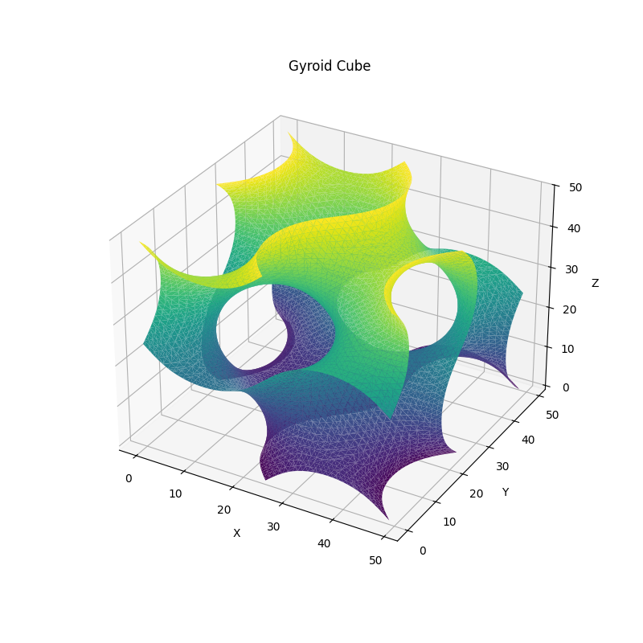

# gyroid

What is a [Gyroid](https://en.wikipedia.org/wiki/Gyroid).
 [INFINITE PERIODIC MINIMAL SURFACES WITHOUT SELF-INTERSECTIONS](https://ntrs.nasa.gov/api/citations/19700020472/downloads/19700020472.pdf)
## sin(x)cos(y)+sin(y)cos(z)+sin(z)cos(x)=0

